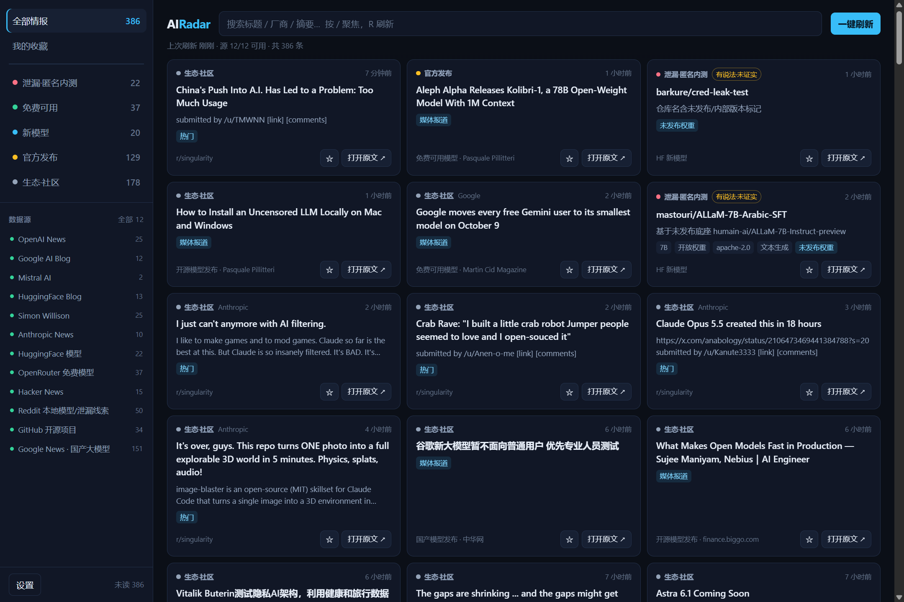

<div align="center">

# AI Radar · 全球 AI 情报雷达

**一键拉取全球 AI 最新情报** —— 新发布模型 / 免费可用模型 / 泄漏与匿名内测线索

[](https://github.com/yubin1-0-4-6/AI-Radar/actions/workflows/release.yml)
[](LICENSE)


Tauri 2 + React 桌面应用 · 托盘常驻 · 单轮约 2 秒拉完 380+ 条

</div>



> 桌面版真实运行状态，只截「泄漏·匿名内测」这一个分类——这是本应用最有辨识度的部分。
> 每张卡片带**可信度分级**：绿色「有证据·多源印证」、琥珀色「有说法·未证实」，
> 以及来自 HuggingFace 的「未发布权重」标记。左侧为分类计数与 12 个源的实时健康度。
> 图中均为该分类的实际条目（模型开启内测但未对外开放、厂商被曝智能体泄露用户图片等）。

---

## 这个应用解决什么问题

每天想看"全世界 AI 又出了什么新模型、哪些能白嫖、哪些正在内测"，得手动刷十几个网站。
AI Radar 把这些聚到一个窗口，点一次刷新全部拉完，并按**你真正关心的三件事**分类：

| 分类 | 判定依据 | 举例 |
|---|---|---|
| **泄漏·匿名内测** | 未正式发布的权重出现在公开仓库，或社区/媒体出现明确说法 | 带 `preview`/`ngl` 标签的权重、`内测` 报道 |
| **免费可用** | OpenRouter 上 `pricing == 0`（权威判定），或开放权重可本地跑 | `prompt` 与 `completion` 定价均为 0 的模型 |
| **新模型** | HuggingFace 新上传且已有热度，OpenRouter 新上架 | 热门权重、参数与上下文长度 |

## 关于"匿名内测模型"的诚实说明

不存在"全球匿名内测模型"的权威接口——**未发布的模型不会出现在任何公开 API 里**。
本应用能提供的是**可验证的公开痕迹**，并对每一条标注可信度：

| 标记 | 含义 | 数据来源 |
|---|---|---|
| `未发布权重` | 仓库名含 `preview/internal/alpha/ngl/codename` 等未发布标记，或带 `ngl` 标签 | HuggingFace API |
| `有说法·未证实` | 社区/媒体出现明确说法但无官方确认 | Reddit、HN、Google News |
| `有证据·多源印证` | 命中权重/截图/多源交叉描述 | 同上 |

这些**不是厂商官方确认**，UI 上会一直显示。把它当线索雷达，不当新闻源。

## 安装

从 [Releases](https://github.com/yubin1-0-4-6/AI-Radar/releases) 下载安装包：

| 平台 | 安装包 | 备注 |
|---|---|---|
| Windows | `AI Radar_<version>_x64-setup.exe` | NSIS，双击安装 |
| Linux | `AI Radar_<version>_amd64.deb` | |

> macOS 构建目前在 CI 里产不出资产（job 报成功但没有可上传的产物，根因待查），
> 因此暂不提供 `.dmg`。需要的话可本地 `npm run app:build` 自行打包。

Windows 安装后桌面与开始菜单会出现入口，程序常驻系统托盘：
**左键**托盘图标唤出窗口，**右键**出菜单（打开 / 立即刷新 / 退出）。
关闭窗口不会退出，只有托盘菜单的「退出」才是真退出。

### 从源码构建

```bash
git clone https://github.com/yubin1-0-4-6/AI-Radar.git
cd AI-Radar
npm install

npm run probe       # 对全部源跑真实网络验证，打印健康度报告
npm run dev         # 浏览器预览模式（无托盘/通知）
npm run app         # 桌面应用（Tauri）
npm run app:build   # 打包 Windows 安装包（nsis + msi）
```

桌面模式需要 Rust 工具链：

```powershell
winget install --id Rustlang.Rustup -e --source winget
```

## 使用

1. 点右上角 **一键刷新** —— 约 2 秒拉完 12 个源
2. 左侧按分类筛选，或用搜索框（按 `/` 聚焦，按 `R` 刷新）
3. 点卡片标记已读，点 **打开原文 ↗** 跳到出处
4. 设置里可调自动刷新间隔、开机自启、桌面通知、只看未读

## 数据源（12 个，全部实测通过，单轮约 2 秒）

| 源 | 覆盖 |
|---|---|
| HuggingFace API | 热门模型 / 新上传模型 / 未发布权重线索 |
| OpenRouter API | 免费可调用模型（prompt 与 completion 定价均为 0）+ 新上架 |
| Anthropic News | 官方发布（无 RSS，解析服务端渲染页面） |
| OpenAI / Google AI / Mistral / HuggingFace Blog 官方 RSS | 官方发布 |
| Simon Willison | 独立评测与观察 |
| Hacker News（Algolia） | 社区热议 |
| Reddit r/LocalLLaMA / r/MachineLearning / r/singularity | 本地模型与泄漏讨论 |
| GitHub Search | 近期新出现的 AI 开源项目 |
| Google News RSS（6 组定向查询，中英双语） | 国产模型动态、**内测**、**泄漏**、免费可用 |

已实测不可用并已替换的方案：DeepSeek / Moonshot / 智谱 / MiniMax 的 `rss.xml`
返回的是前端渲染 HTML，Qwen 的 `index.xml` 停更一年以上——统一改由 Google News 覆盖。

<details>
<summary>已下线的板块</summary>

**论文 / arXiv**（`cs.AI`、`cs.CL`、`cs.LG`）暂时移除。
恢复需改：`src/types.ts` 的 `IntelKind` 加回 `"paper"`、`SourceId` 加回 `"arxiv"`；
`src/classify.ts` 的 `KIND_LABEL`、`src/ui/Sidebar.tsx` 的 `ORDER` 与 `DOT`、
`src/ui/ItemCard.tsx` 的 `KIND_STYLE` 各加一行；再把 `fetchArxiv` 注册进
`src/sources/index.ts` 的 `SOURCES` 并补回适配器文件。

</details>

## 隐私

数据全部在本地缓存，**不上传任何内容**。已读 / 收藏 / 设置存于本地存储。
「打开原文」只在系统浏览器里打开外部链接（Rust 侧有 http/https 白名单）。

## 桌面端排查

```bash
npm run app:cdp                            # 带 WebView2 调试端口启动
node scripts/cdp-probe.mjs                 # 读运行中页面的真实状态（源成功率、DOM、报错）
node scripts/capture-screenshot.mjs docs/screenshot.png 1.5 leak  # 只截泄漏分类
```

正式配置**不带**调试端口（`src-tauri/tauri.conf.json`），
需要时用 `src-tauri/tauri.cdp.json` 叠加启用。

## 已知限制

- 浏览器预览模式（`npm run dev`）下 **Mistral 源会失败**：Vite dev proxy 对该路径有异常行为。
  桌面模式走 `tauri-plugin-http` 直连，不受影响（`npm run probe` 里始终正常）。
- Google News 的条目链接是 `news.google.com` 跳转地址，点击后在系统浏览器打开可正常到达原文。
- Reddit 按 UA 做风控，必须用唯一 User-Agent（见 `src/lib/http.ts`），
  高频刷新可能触发临时限流，下次刷新会自动恢复。

## 踩过的坑（都已在代码里注释）

1. **`tauri-plugin-http` 的 `http:default` 不放开任何 origin**，只启用 fetch 能力。
   不在 capability 里显式写 `allow: [{ "url": "https://**" }]`，运行时所有请求都会报
   `url not allowed on the configured scope`。
2. **RSS 的 `<title><![CDATA[...]]></title>`** 会被朴素的剥标签逻辑整段吃掉，
   必须先剥 CDATA 壳（`src/lib/xml.ts` 的 `unwrapCdata`）。
3. **Atom feed 双重转义**（`&lt;p&gt;`）：只剥一次标签会把标签当正文显示，
   "解码 → 剥标签"要跑两轮。
4. **Google News 标题里塞零宽字符**做防抓取，必须显式清除。
5. **Google News 对 `OR` 的处理很脆弱**：`内测 大模型` 返回 36 条，
   `内测 大模型 OR 灰度 公测` 只剩 1 条。查询串是逐条实测调出来的。
6. **Vite 的 watcher 会盯到 `src-tauri/target/`**，Windows 上文件锁直接 `EBUSY` 崩掉，
   必须在 `server.watch.ignored` 里排除。
7. **GitHub 用 `pushed_at` 当时间戳会让老仓库永远排第一**，必须用 `created_at`
   并把时间过滤下推给 GitHub 服务端（`created:>`）。
8. **`.gitignore` 里 `target/` 不能写成 `/target`**：前导斜杠只锚定到文件所在目录，
   会漏掉 `src-tauri/target`（本机 9.5 GB）。

## 参与开发

改动代码、发版流程、自查清单见 [CONTRIBUTING.md](CONTRIBUTING.md)。

## 结构

```
src/
  lib/http.ts          统一 HTTP（Tauri / 浏览器 proxy / Node 三态）
  lib/xml.ts           零依赖 RSS 2.0 + Atom 解析（含 CDATA、零宽字符）
  sources/             各情报源适配器，一个源一个文件
  classify.ts          分类引擎：泄漏信号强度、免费判定、厂商识别
  store.ts             本地持久化（已读 / 收藏 / 设置）
  shell.ts             托盘、通知、外部链接、开机自启（Tauri 能力入口）
scripts/
  probe.ts             真实网络健康度验证
  cdp-probe.mjs        从运行中的桌面端读真实状态
  capture-screenshot.mjs  从桌面端 WebView 截图
  make-icon.mjs        零依赖生成应用图标
src-tauri/             托盘常驻 / 角标 / 通知 / 开机自启 / 外部链接白名单
docs/screenshot.png    README 配图
```

## License

[MIT](LICENSE) © 2026 yubin1-0-4-6